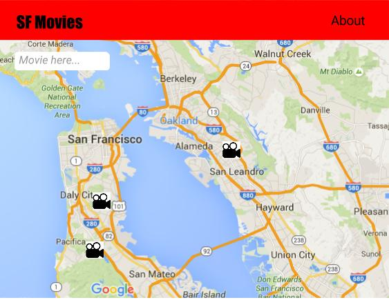

#What's in this Repository

An application that shows on a map where movies have been filmed in San Francisco.
The user will be able to filter the view using autocompletion search.

This is a mock-up:

#How to Run This Code Locally

<b>Note</b>: In order to run this locally you first must have Node installed on
your machine.

To run the code locally on your machine you must first clone the repository.

Then you must run: `npm i`.

If you plan on making on changes start webpack by entering `npm start`.

To start the server enter `npm run dev` and open up `localhost:3000`.

The application will now appear!

# Authors

This project was built by two awesome software engineers:

  * Jonathan Tamsut | [GithHub](https://github.com/jtamsut) | [LinkedIn](https://www.linkedin.com/in/jtamsut)
  * Daniel Russell | [GithHub](https://github.com/danielrussellLA) |  [LinkedIn]([LinkedIn](https://www.linkedin.com/in/jtamsut))
